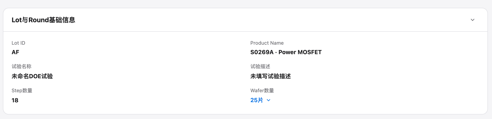

# 实验/lot

## Intake

- Component name: 实验/lot
- Sequence: 001
- Source screenshot: `screenshot.png`
- Original screenshot filename: `codex-clipboard-e1a92dad-b6fd-485a-b7bf-933b2d5e081e.png`
- Original screenshot size: 2382 x 578
- Intake status: Raw user input

## Screenshot



## User Notes

这是第一个业务组件。

```text
name: 实验/lot
```

## Observed UI Region

The screenshot shows a single collapsed-card style domain section titled
`Lot与Round基础信息`.

Visible fields:

- `Lot ID`: `AF`
- `Product Name`: `S0269A · Power MOSFET`
- `试验名称`: `未命名DOE试验`
- `试验描述`: `未填写试验描述`
- `Step数量`: `18`
- `Wafer数量`: `25片`

Visible local interaction:

- Section collapse / expand affordance.
- Wafer count value appears as a selectable affordance.

## Candidate Domain Boundary

This upstream input suggests a business component centered on the current
experiment and Lot context.

Candidate responsibilities:

- Present the Lot / experiment identity.
- Present product context.
- Present experiment name and description.
- Present Step and Wafer counts.
- Allow local reveal or selection around wafer count, if confirmed by later
  inputs.

Out of scope during intake:

- No application routing.
- No backend fetch.
- No MES or Gateway call.
- No workflow transition.

## Open Questions

- Is the canonical component name `实验/lot`, `ExperimentLot`, or another
  domain term?
- Does `Round` belong inside this component boundary, or is the title inherited
  from the prototype section layout?
- Is the collapsible card frame part of this component or a separate domain
  layout component?
- Is the wafer count dropdown part of this component or a separate Wafer list /
  selector component?
