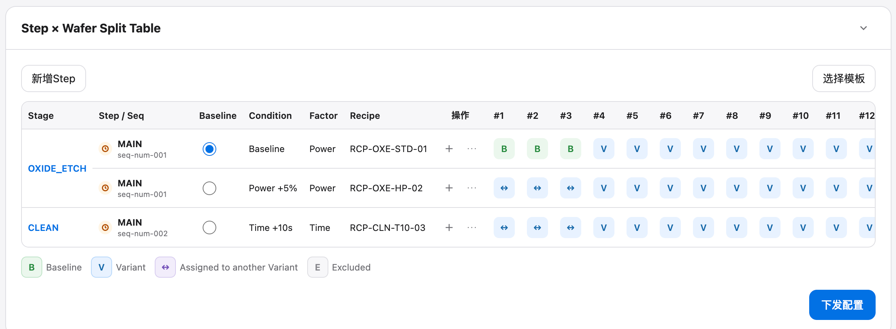

# 实验/lot/step/steps

## Intake

- Component name: 实验/lot/step/steps
- Sequence: 002
- Source screenshot: `screenshot.png`
- Original screenshot filename: `codex-clipboard-894861ac-3efc-4f80-b79a-539401b002a1.png`
- Original screenshot size: 2374 x 872
- Intake status: Raw user input

## Screenshot



## User Notes

```text
name: 实验/lot/step/steps
```

## Observed UI Region

The screenshot shows a domain section titled `Step × Wafer Split Table`.

Visible controls:

- `新增Step`
- `选择模板`
- `下发配置`
- Section collapse / expand affordance.

Visible table columns:

- `Stage`
- `Step / Seq`
- `Baseline`
- `Condition`
- `Factor`
- `Recipe`
- `操作`
- Wafer columns such as `#1` through `#12` in the visible crop.

Visible rows:

- Stage `OXIDE_ETCH`
  - Step `MAIN`
  - Sequence `seq-num-001`
  - Baseline condition
  - Factor `Power`
  - Recipe `RCP-OXE-STD-01`
- Stage `OXIDE_ETCH`
  - Step `MAIN`
  - Sequence `seq-num-001`
  - Condition `Power +5%`
  - Factor `Power`
  - Recipe `RCP-OXE-HP-02`
- Stage `CLEAN`
  - Step `MAIN`
  - Sequence `seq-num-002`
  - Condition `Time +10s`
  - Factor `Time`
  - Recipe `RCP-CLN-T10-03`

Visible wafer assignment legend:

- `B`: Baseline
- `V`: Variant
- `↔`: Assigned to another Variant
- `E`: Excluded

## Candidate Domain Boundary

This upstream input suggests a business component that presents and locally
operates on the Step-level split assignment for a Lot / experiment.

Candidate responsibilities:

- Present Stage and Step / Sequence rows.
- Present baseline selection.
- Present condition, factor, and recipe for each step row.
- Present per-wafer assignment cells.
- Present wafer assignment legend.
- Expose local action affordances for adding steps, choosing templates, row
  operations, and release configuration.

Out of scope during intake:

- No MES release implementation.
- No application workflow transition.
- No backend save or template fetch.
- No cross-page state machine.

## Open Questions

- Is this one component boundary, or should table, toolbar, wafer cells, and
  legend become separate nested business components?
- Does `steps` mean the whole Split Table surface or only the Step row group?
- Does `下发配置` belong to this component as an action callback, or to a
  release/execution component boundary?
- Are the `B` / `V` / `↔` / `E` cells part of this component, or a reusable
  wafer assignment cell component used by it?
- Is the collapsible card frame part of this component or a separate domain
  layout component?
