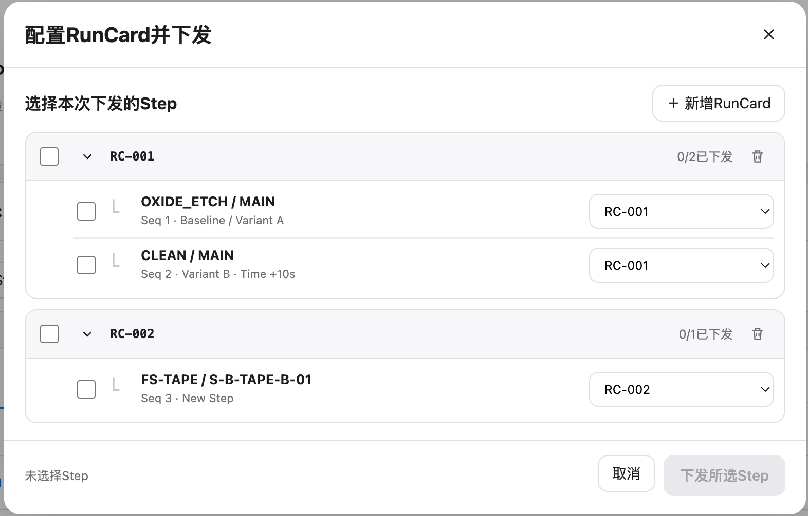

# 实验/lot/step/steps/runcard

## Intake

- Component name: 实验/lot/step/steps/runcard
- Sequence: 003
- Source screenshot: `screenshot.png`
- Original screenshot filename: `codex-clipboard-58bb8e2f-199c-4037-86f0-0be770be2fa9.png`
- Original screenshot size: 1572 x 1006
- Intake status: Raw user input

## Screenshot



## User Notes

```text
name: 实验/lot/step/steps/runcard
```

## Observed UI Region

The screenshot shows a modal-like domain surface titled `配置RunCard并下发`.

Visible controls:

- Close affordance.
- `+ 新增RunCard`
- Per-RunCard checkbox.
- Per-RunCard expand / collapse affordance.
- Per-RunCard delete affordance.
- Per-Step checkbox.
- Per-Step RunCard selector.
- Footer actions: `取消`, `下发所选Step`.

Visible RunCard groups:

- `RC-001`
  - Progress text: `0/2已下发`
  - Step `OXIDE_ETCH / MAIN`
    - `Seq 1 · Baseline / Variant A`
    - Selector value `RC-001`
  - Step `CLEAN / MAIN`
    - `Seq 2 · Variant B · Time +10s`
    - Selector value `RC-001`
- `RC-002`
  - Progress text: `0/1已下发`
  - Step `FS-TAPE / S-B-TAPE-B-01`
    - `Seq 3 · New Step`
    - Selector value `RC-002`

Visible footer state:

- `未选择Step`
- `下发所选Step` appears disabled.

## Candidate Domain Boundary

This upstream input suggests a business component that groups selected Steps
into RunCards before release.

Candidate responsibilities:

- Present RunCard groups.
- Present Step membership under each RunCard.
- Present release progress per RunCard.
- Allow local Step selection.
- Allow local RunCard assignment selection per Step.
- Expose callbacks for adding RunCards, deleting RunCards, cancelling, and
  confirming release.

Out of scope during intake:

- No real MES submission.
- No backend RunCard creation.
- No cross-page release workflow.
- No hidden service calls inside the component.

## Open Questions

- Is this a standalone business component or a modal variant of the Step split
  component?
- Is `RunCard` a confirmed domain concept or an execution packaging concept
  that belongs under release configuration?
- Does selecting a RunCard mutate Step assignment locally, or does it only
  prepare a release request?
- Should the footer selected-step count be part of this component or supplied
  by the application workflow?
- Is `下发所选Step` an action callback on this component, or should release be
  represented by a separate execution-control component?
