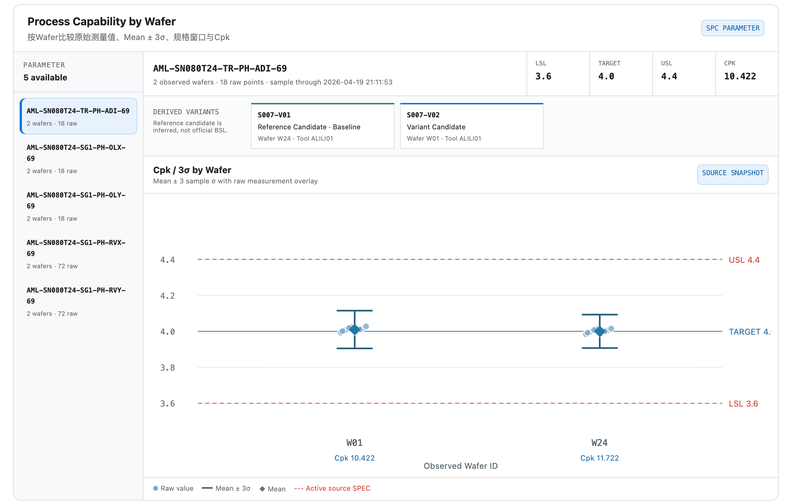

# 实验/lot/step/steps/stage/wafer

## Intake

- Component name: 实验/lot/step/steps/stage/wafer
- Sequence: 004
- Source screenshot: `screenshot.png`
- Original screenshot filename: `codex-clipboard-0590a50a-bdf0-4ac9-a0aa-c558a02850de.png`
- Original screenshot size: 2296 x 1470
- Intake status: Raw user input

## Screenshot



## User Notes

```text
name: 实验/lot/step/steps/stage/wafer
```

## Observed UI Region

The screenshot shows a process capability surface titled
`Process Capability by Wafer`.

Visible subtitle:

- `按Wafer比较原始测量值、Mean ± 3σ、规格窗口与Cpk`

Visible controls / badges:

- `SPC`
- `PARAMETER`
- `SOURCE SNAPSHOT`

Visible left parameter list:

- Header: `PARAMETER`
- Count: `5 available`
- Selected parameter: `AML-SN080T24-TR-PH-ADI-69`
  - `2 wafers · 18 raw`
- Other visible parameters:
  - `AML-SN080T24-SG1-PH-OLX-69`
  - `AML-SN080T24-SG1-PH-OLY-69`
  - `AML-SN080T24-SG1-PH-RVX-69`
  - `AML-SN080T24-SG1-PH-RVY-69`

Visible selected parameter header:

- Parameter: `AML-SN080T24-TR-PH-ADI-69`
- Observation summary: `2 observed wafers · 18 raw points · sample through 2026-04-19 21:11:53`

Visible specification / capability fields:

- `LSL`: `3.6`
- `TARGET`: `4.0`
- `USL`: `4.4`
- `CPK`: `10.422`

Visible derived variants:

- `S007-V01`
  - `Reference Candidate · Baseline`
  - `Wafer W24 · Tool ALILIO1`
- `S007-V02`
  - `Variant Candidate`
  - `Wafer W01 · Tool ALILIO1`

Visible chart area:

- Title: `Cpk / 3σ by Wafer`
- Subtitle: `Mean ± 3 sample σ with raw measurement overlay`
- Wafer IDs: `W01`, `W24`
- Per-wafer Cpk labels:
  - `W01`: `Cpk 10.422`
  - `W24`: `Cpk 11.722`
- Spec guide lines:
  - `USL 4.4`
  - `TARGET 4.0`
  - `LSL 3.6`
- X-axis label: `Observed Wafer ID`
- Legend:
  - `Raw value`
  - `Mean ± 3σ`
  - `Mean`
  - `Active source SPEC`

## Candidate Domain Boundary

This upstream input suggests a business component that compares source-backed
process capability by observed wafer within a Stage / Step context.

Candidate responsibilities:

- Present a selectable Inline/SPC parameter list.
- Present observed wafer count, raw measurement count, and sample timestamp.
- Present active source specification values such as LSL, TARGET, USL, and Cpk.
- Present derived variant candidates and wafer/tool context.
- Render wafer-level raw measurement overlay, mean, mean ± 3σ, and spec guide
  lines.
- Expose access to source snapshot details.

Out of scope during intake:

- No claim that observed wafer scope equals planned, released, executed, or
  completed wafer scope.
- No causal conclusion from process capability to CP/Yield outcome.
- No hidden source fetch.
- No formal RCA, verdict, action, or next-round recommendation.

## Open Questions

- Is this component primarily `ProcessCapabilityByWafer`, or should the
  canonical boundary be under Stage observation / Inline SPC?
- Does `stage/wafer` mean the component is scoped by Stage first and grouped by
  observed wafer, or does it belong under a broader stage detail panel?
- Are derived variants part of this component, or should they be a separate
  candidate mapping component reused elsewhere?
- Should `SOURCE SNAPSHOT` open a shared source snapshot component?
- Which fields are source-confirmed and which are source-provisional?
