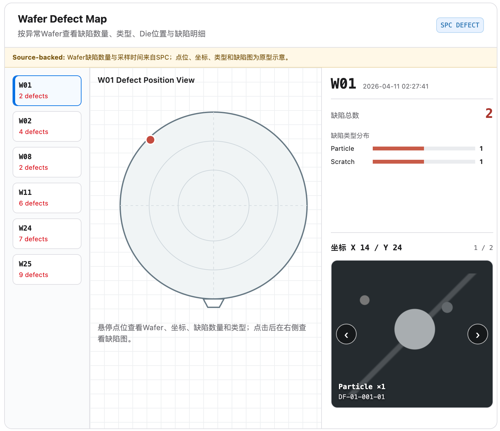

# 实验/lot/step/steps/stage/wafer-defect

## Intake

- Component name: 实验/lot/step/steps/stage/wafer-defect
- Sequence: 005
- Source screenshot: `screenshot.png`
- Original screenshot filename: `codex-clipboard-5dd7caff-14fa-425d-b84c-f00dffd0856f.png`
- Original screenshot size: 1552 x 1338
- Intake status: Raw user input

## Screenshot



## Interaction Notes

- Detailed behavior has been distilled in `docs/upstream/interactions/003-wafer-defect-map/`.

## User Notes

```text
name: 实验/lot/step/steps/stage/wafer-defect
```

## Observed UI Region

The screenshot shows a defect observation surface titled `Wafer Defect Map`.

Visible subtitle:

- `按异常Wafer查看缺陷数量、类型、Die位置与缺陷明细`

Visible badges:

- `SPC`
- `DEFECT`

Visible source notice:

- `Source-backed: Wafer缺陷数量与采样时间来自SPC；点位、坐标、类型和缺陷图为原型示意。`

Visible left wafer defect list:

- `W01`
  - `2 defects`
- `W02`
  - `4 defects`
- `W08`
  - `2 defects`
- `W11`
  - `6 defects`
- `W24`
  - `7 defects`
- `W25`
  - `9 defects`

Visible central map:

- Title: `W01 Defect Position View`
- Wafer outline with grid, rings, crosshair, and notch.
- One visible defect point in the upper-left wafer area.
- Instruction text: `悬停点位查看Wafer、坐标、缺陷数量和类型；点击后在右侧查看缺陷图。`

Visible right detail panel:

- Selected wafer: `W01`
- Timestamp: `2026-04-11 02:27:41`
- Defect total: `2`
- Defect type distribution:
  - `Particle`: `1`
  - `Scratch`: `1`
- Selected defect coordinate:
  - `坐标 X 14 / Y 24`
- Detail index:
  - `1 / 2`
- Defect preview card:
  - Label `Particle ×1`
  - ID `DF-01-001-01`
  - Previous / next affordances.

## Candidate Domain Boundary

This upstream input suggests a business component that presents wafer-level
defect observations and defect-position detail within a Stage / wafer context.

Candidate responsibilities:

- Present wafer-level defect counts.
- Allow selecting a wafer from an abnormal-wafer list.
- Render wafer defect positions on a wafer coordinate map.
- Present source-backed timestamp and defect-count summary.
- Present defect type distribution.
- Present selected defect coordinate and defect detail preview.
- Distinguish source-backed facts from prototype illustrative assets.

Out of scope during intake:

- No claim that no defect record means defect-free.
- No formal DMS evidence claim unless source fields are confirmed.
- No root-cause conclusion.
- No hidden source fetch.
- No automatic action or next-round recommendation.

## Open Questions

- Is this canonical component `WaferDefectMap`, or should it be split into
  wafer defect list, defect position map, and defect detail panel?
- Are defect point coordinates source-backed, prototype illustrative, or mixed?
- Should the right-side defect preview be a reusable `DefectDetail` component?
- Should `Coverage Unknown` be shown when defect data is incomplete or absent?
- Is the `Source-backed` notice part of this component or a shared data
  authenticity / provenance component?
