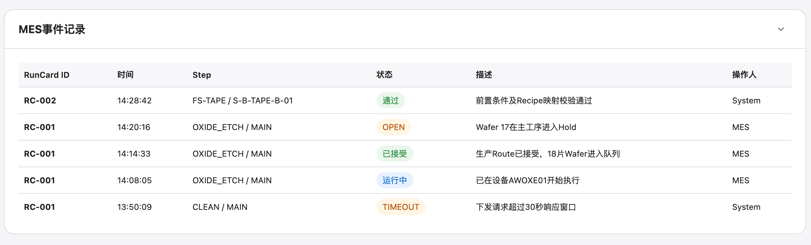

# 实验/lot/step/steps/runcard/history

## Intake

- Component name: 实验/lot/step/steps/runcard/history
- Sequence: 006
- Source screenshot: `screenshot.png`
- Original screenshot filename: `codex-clipboard-73d10521-8d6d-4b70-b548-767961e89c53.png`
- Original screenshot size: 2374 x 718
- Intake status: Raw user input

## Screenshot



## User Notes

```text
name: 实验/lot/step/steps/runcard/history
```

## Observed UI Region

The screenshot shows a collapsible domain section titled `MES事件记录`.

Visible table columns:

- `RunCard ID`
- `时间`
- `Step`
- `状态`
- `描述`
- `操作人`

Visible events:

- `RC-002`
  - Time: `14:28:42`
  - Step: `FS-TAPE / S-B-TAPE-B-01`
  - Status: `通过`
  - Description: `前置条件及Recipe映射校验通过`
  - Operator: `System`
- `RC-001`
  - Time: `14:20:16`
  - Step: `OXIDE_ETCH / MAIN`
  - Status: `OPEN`
  - Description: `Wafer 17在主工序进入Hold`
  - Operator: `MES`
- `RC-001`
  - Time: `14:14:33`
  - Step: `OXIDE_ETCH / MAIN`
  - Status: `已接受`
  - Description: `生产Route已接受，18片Wafer进入队列`
  - Operator: `MES`
- `RC-001`
  - Time: `14:08:05`
  - Step: `OXIDE_ETCH / MAIN`
  - Status: `运行中`
  - Description: `已在设备AWOXE01开始执行`
  - Operator: `MES`
- `RC-001`
  - Time: `13:50:09`
  - Step: `CLEAN / MAIN`
  - Status: `TIMEOUT`
  - Description: `下发请求超过30秒响应窗口`
  - Operator: `System`

Visible local interaction:

- Section collapse / expand affordance.

## Candidate Domain Boundary

This upstream input suggests a business component that presents MES / RunCard
event history for released or releasing Steps.

Candidate responsibilities:

- Present chronological RunCard-related MES events.
- Group each event by RunCard ID and Step.
- Preserve event time, status, description, and operator.
- Render MES / System status vocabulary without flattening distinct states.
- Support local collapse / expand if this section owns its own frame.

Out of scope during intake:

- No polling or live MES connection.
- No event mutation.
- No retry / resend action unless later screenshots include it.
- No causal diagnosis from event text.

## Open Questions

- Is the canonical component `MESEventLog`, `RunCardHistory`, or a nested
  `RunCardEventHistory`?
- Does this component belong under RunCard, under Step execution, or under a
  broader Experiment Execution Center history surface?
- Should statuses like `OPEN`, `TIMEOUT`, `运行中`, `已接受`, and `通过` share a
  controlled execution-event status schema?
- Is the collapsible section frame part of this component or a shared domain
  layout section?
- Are event rows source-backed MES facts, system-derived facts, or mixed?
