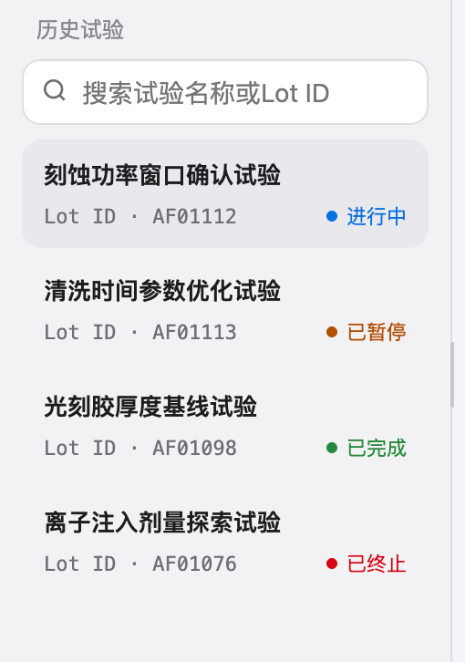

# 实验/history

## Intake

- Component name: 实验/history
- Sequence: 007
- Source screenshot: `screenshot.png`
- Original screenshot filename: `codex-clipboard-d2a022f5-0687-4849-984d-b1b4a48c679b.png`
- Original screenshot size: 510 x 726
- Intake status: Raw user input

## Screenshot



## User Notes

Raw user input:

```text
name: name: 实验/history
```

Normalized intake name:

```text
name: 实验/history
```

## Observed UI Region

The screenshot shows a history list section titled `历史试验`.

Visible search affordance:

- Placeholder: `搜索试验名称或Lot ID`

Visible history items:

- `刻蚀功率窗口确认试验`
  - `Lot ID · AF01112`
  - Status: `进行中`
- `清洗时间参数优化试验`
  - `Lot ID · AF01113`
  - Status: `已暂停`
- `光刻胶厚度基线试验`
  - `Lot ID · AF01098`
  - Status: `已完成`
- `离子注入剂量探索试验`
  - `Lot ID · AF01076`
  - Status: `已终止`

Visible local interaction:

- Search by experiment name or Lot ID.
- Selecting a history item.
- Scrollable history list.

## Candidate Domain Boundary

This upstream input suggests a business component that lists historical
experiments / Lots with their current experiment state.

Candidate responsibilities:

- Present searchable experiment history.
- Present experiment name and Lot ID for each item.
- Present experiment lifecycle state per item.
- Highlight or select the active history item.
- Support local filtering or search input.

Out of scope during intake:

- No application navigation decision.
- No backend history fetch.
- No cross-page route ownership.
- No mutation of experiment state.

## Open Questions

- Is this a domain component, or should it remain application navigation?
- Is the canonical component name `ExperimentHistory`, `LotHistory`, or
  `ExperimentLotHistory`?
- Should status display reuse a shared `ExperimentStateBadge` component?
- Does search own only local filtering, or should it expose a query callback to
  an application-side history source?
- Is active item selection part of this component or controlled externally by
  the application shell?
