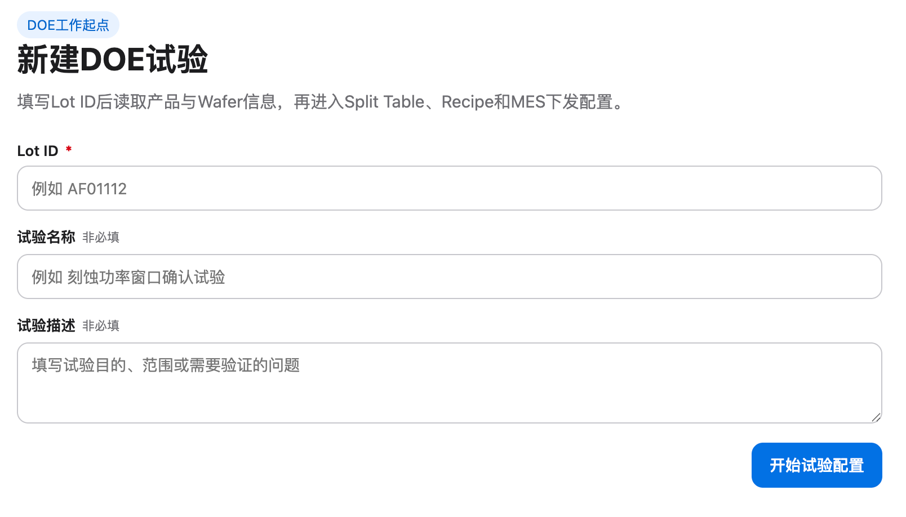

# 实验

## Intake

- Component name: 实验
- Sequence: 008
- Source screenshot: `screenshot.png`
- Original screenshot filename: `codex-clipboard-f756ebb9-8a78-40d2-aefe-cf4768121abc.png`
- Original screenshot size: 1608 x 918
- Intake status: Raw user input

## Screenshot



## User Notes

```text
name: 实验
```

User also noted:

```text
引入 shadcn React Hook Form 表单
https://ui.shadcn.com/docs/forms/react-hook-form
```

## Observed UI Region

The screenshot shows a DOE creation form surface.

Visible header:

- Pill label: `DOE工作起点`
- Title: `新建DOE试验`
- Description: `填写Lot ID后读取产品与Wafer信息，再进入Split Table、Recipe和MES下发配置。`

Visible form fields:

- `Lot ID`
  - Required marker: `*`
  - Placeholder: `例如 AF01112`
- `试验名称`
  - Optional marker: `非必填`
  - Placeholder: `例如 刻蚀功率窗口确认试验`
- `试验描述`
  - Optional marker: `非必填`
  - Placeholder: `填写试验目的、范围或需要验证的问题`

Visible action:

- Primary button: `开始试验配置`

## Candidate Domain Boundary

This upstream input suggests a business component centered on creating or
starting a DOE experiment from a Lot ID.

Candidate responsibilities:

- Present the DOE experiment start form.
- Capture the user-provided Lot ID.
- Capture optional experiment name and description.
- Express that Lot ID is required before entering later configuration.
- Expose submit / change callbacks for the application to handle.
- Use shadcn form primitives with React Hook Form for local form state and
  validation when implemented.

Out of scope during intake:

- No direct product / wafer fetch inside the component.
- No direct navigation into Split Table.
- No direct Recipe or MES release configuration.
- No application workflow ownership.
- No hidden backend or Gateway calls.

## Open Questions

- Is the canonical component export `Experiment`, `ExperimentStart`, or another
  domain term?
- Is `Lot ID` the only required input before the application can fetch product
  and wafer context?
- Does this component own validation messages, or should validation copy come
  from schema metadata?
- Should submit be disabled until Lot ID is valid, or should submission surface
  validation errors?
- Is this a reusable domain component or a first-screen application layout
  fragment?
