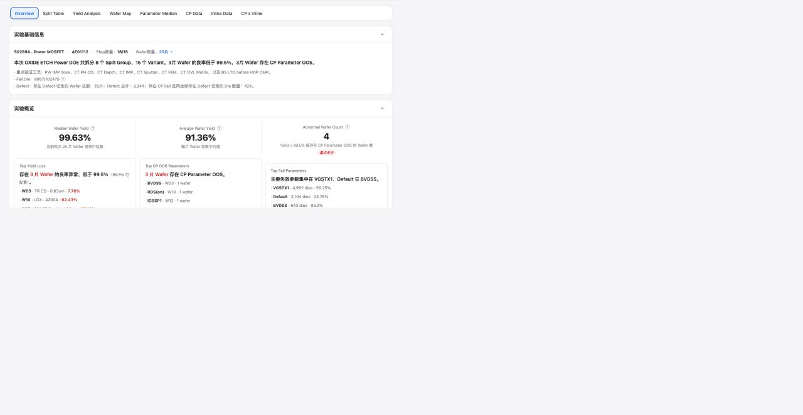

# Report Overview

## Intake

- Component name: Report Overview
- Sequence: 010
- Source page: `http://127.0.0.1:8888/DOE%20report.html`
- Parent prototype surface: `DOE Report`
- Source screenshot: `screenshot.png`
- Intake status: Raw prototype observation from user-directed browser review

## Screenshot



## User Notes

```text
除了左侧的侧边栏，重点是看右侧 各个 tabs 每个 tab 都是一个大业务组件，
然后 每个tab 里面 酌情分解。
```

This record treats the `Overview` tab as one large report business component.
Internal sections are only candidate sub-parts during upstream intake.

## Observed UI Region

The screenshot shows the `DOE Report` surface with the `Overview` tab active.

Visible report tabs:

- `Overview`
- `Split Table`
- `Yield Analysis`
- `Wafer Map`
- `Parameter Median`
- `CP Data`
- `Inline Data`
- `CP x Inline`

Visible content sections:

- `实验基础信息`
- `实验概览`
- `Split Table x 异常Yield`
- `当前轮次重点`
- `主要失效组`
- `低良率晶圆`
- `参数异常提醒`

Visible data themes:

- Product and lot identity, such as `S0269A · Power MOSFET` and `AF01112`.
- Step and wafer count summary.
- DOE round narrative and重点验证工艺 list.
- Fail Die and Defect summary.
- Yield distribution and exception reminders.

## Candidate Domain Boundary

Candidate responsibilities:

- Present a read-only DOE report overview for one experiment or report round.
- Summarize experiment identity, product, lot, step count, wafer count, split
  count, variant count, yield health, fail die count, and defect count.
- Surface top report concerns across yield, fail parameters, low-yield wafers,
  and CP parameter OOS.
- Provide local drilldown intents into related report components such as Split
  Table, Wafer Map, Parameter Median, or CP Data.

Out of scope during intake:

- No backend fetch, Gateway call, or report generation side effect.
- No root-cause conclusion or engineering recommendation unless explicitly
  provided by upstream report data.
- No ownership of global app navigation or the left sidebar.
- No mutation of DOE configuration, MES release state, or report approval state.

## Candidate Decomposition

- Report identity summary
- Experiment narrative summary
- KPI / count summary tiles
- Yield exception summary
- Top fail parameter summary
- Low-yield wafer summary
- CP parameter OOS alert summary
- Drilldown action model

## Open Questions

- What is the canonical report input DTO for overview-level aggregates?
- Are split count, variant count, fail die count, and defect count all upstream
  computed values?
- Should overview drilldowns control the active report tab, emit callbacks, or
  render links?
- Which thresholds define `异常Yield`, `低良率`, and `OOS` in this report context?
- Is `Overview` report-only, or can it be reused as a dashboard summary outside
  the report page?
