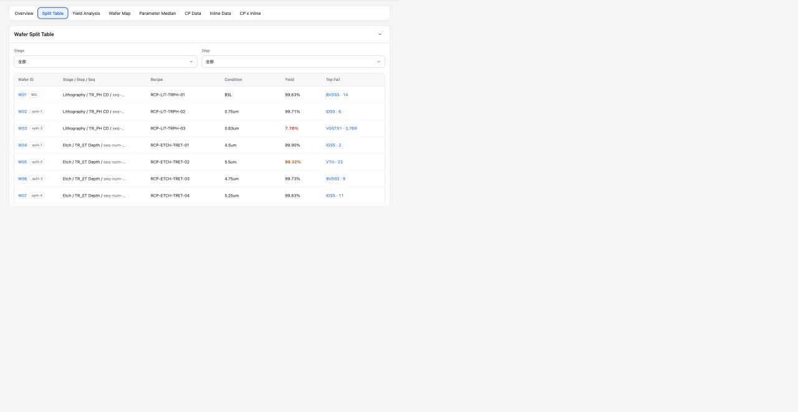

# Report Split Table

## Intake

- Component name: Report Split Table
- Sequence: 011
- Source page: `http://127.0.0.1:8888/DOE%20report.html`
- Parent prototype surface: `DOE Report`
- Source screenshot: `screenshot.png`
- Intake status: Raw prototype observation from user-directed browser review

## Screenshot



## User Notes

```text
除了左侧的侧边栏，重点是看右侧 各个 tabs 每个 tab 都是一个大业务组件，
然后 每个tab 里面 酌情分解。
```

This record treats the `Split Table` tab as one large report business component.
It is distinct from the earlier trial split-table creation component.

## Observed UI Region

The screenshot shows the `DOE Report` surface with the `Split Table` tab active.

Visible heading:

- `Wafer Split Table`

Visible controls:

- `Stage` selector, default `全部`
- `Step` selector, default `全部`

Visible table columns:

- `Wafer ID`
- `Stage / Step / Seq`
- `Recipe`
- `Condition`
- `Yield`
- `Top Fail`

Visible row themes:

- Wafer IDs such as `W01`, `W02`, `W03`.
- Baseline and split labels such as `BSL`, `split-1`, `split-2`.
- Recipe IDs such as `RCP-LIT-TRPH-01`.
- Condition values such as `BSL`, `0.75um`, `0.83um`.
- Yield values with visual severity.
- Top fail parameter links such as `BVDSS`, `IDSS`.

## Candidate Domain Boundary

Candidate responsibilities:

- Present a read-only report view of wafer split assignment and observed yield.
- Filter report rows by stage and step.
- Show wafer, stage, step sequence, recipe, condition, yield, and top fail
  summary in a dense inspection table.
- Expose row, wafer, and top-fail click intents for report drilldown.
- Preserve report evidence as displayed data rather than recalculating workflow
  state.

Out of scope during intake:

- No editing of split assignment, recipe, or condition.
- No MES release behavior.
- No ownership of experiment setup forms.
- No backend calculation of yield or top fail from raw die data inside the
  component.

## Candidate Decomposition

- Stage / step filter bar
- Report split table
- Wafer identity cell
- Stage / step / sequence cell
- Recipe and condition cells
- Yield severity cell
- Top fail link cell

## Open Questions

- Is this component backed by the same data model as the trial split-table
  creation component, or by a report-specific snapshot?
- What thresholds and color semantics should yield severity use?
- Should table rows be sortable by wafer, yield, stage, or top fail?
- Which drilldown target owns a click on `Top Fail`: CP Data, Parameter Median,
  Wafer Map, or a separate fail detail component?
