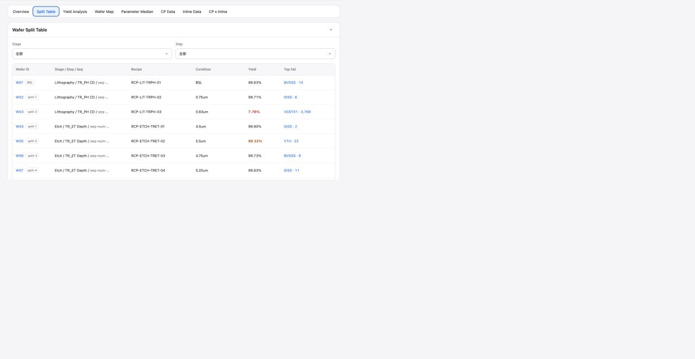

# Report Split Table

## Intake

- Component name: Report Split Table
- Sequence: 011
- Source page: `http://127.0.0.1:8888/DOE%20report.html`
- Parent prototype surface: `DOE Report`
- Source screenshot: `screenshot.png`
- Intake status: Raw prototype observation from user-directed browser review

## Screenshot



## User Notes

```text
除了左侧的侧边栏，重点是看右侧 各个 tabs 每个 tab 都是一个大业务组件，
然后 每个tab 里面 酌情分解。
```

This record treats the `Split Table` tab as one large report business component.
It is distinct from the earlier trial split-table creation component.

## Observed UI Region

The screenshot shows the `DOE Report` surface with the `Split Table` tab active.

Visible heading:

- `Wafer Split Table`

Visible controls:

- `Stage` selector, default `全部`
- `Step` selector, default `全部`

Visible table columns:

- `Wafer ID`
- `Stage / Step / Seq`
- `Recipe`
- `Condition`
- `Yield`
- `Top Fail`

Visible row themes:

- Wafer IDs such as `W01`, `W02`, `W03`.
- Baseline and split labels such as `BSL`, `split-1`, `split-2`.
- Recipe IDs such as `RCP-LIT-TRPH-01`.
- Condition values such as `BSL`, `0.75um`, `0.83um`.
- Yield values with visual severity.
- Top fail parameter links such as `BVDSS`, `IDSS`.

## Candidate Domain Boundary

Candidate responsibilities:

- Present a read-only report view of wafer split assignment and observed yield.
- Filter report rows by stage and step.
- Show wafer, stage, step sequence, recipe, condition, yield, and top fail
  summary in a dense inspection table.
- Expose row, wafer, and top-fail click intents for report drilldown.
- Preserve report evidence as displayed data rather than recalculating workflow
  state.

Out of scope during intake:

- No editing of split assignment, recipe, or condition.
- No MES release behavior.
- No ownership of experiment setup forms.
- No backend calculation of yield or top fail from raw die data inside the
  component.

## Candidate Decomposition

- Stage / step filter bar
- Report split table
- Wafer identity cell
- Stage / step / sequence cell
- Recipe and condition cells
- Yield severity cell
- Top fail link cell

## Open Questions

- Is this component backed by the same data model as the trial split-table
  creation component, or by a report-specific snapshot?
- What thresholds and color semantics should yield severity use?
- Should table rows be sortable by wafer, yield, stage, or top fail?
- Which drilldown target owns a click on `Top Fail`: CP Data, Parameter Median,
  Wafer Map, or a separate fail detail component?

## Post-intake Implementation Notes

- Current implementation treats this as a report-specific snapshot, not the
  editable trial split-table data model.
- Stage / Step filtering is local to `ReportSplitTable` in the current
  Component Lab preview.
- `Top Fail` is display data by default; drilldown can be exposed as callback
  intent, but the component does not own the target workflow.
- Yield severity follows the report convention used by current fixtures:
  `< 90%` bad, `90%-99.5%` watch, `>= 99.5%` good.
- The table uses the Layout Shell comfortable base-Table presentation (14px
  text, 40px transparent header, 8px cells). Wide report projections retain a
  local horizontal scroll container rather than changing page width.
- The 2026-09-22 table alignment uses the local `DOE Workbench 单文件版.html`
  `renderSplit` implementation as reference evidence. Rows are grouped by
  `Stage + Step + Seq`, Baseline renders first, split labels are assigned by
  distinct condition within the group, and source-provided `topFails` may show
  multiple CP parameters in one cell. Cross-tab navigation from the prototype
  remains outside this Domain UI component.

## 2026-09-22 Wafer Yield & CP Fail Analysis Addition

The user confirmed that `Wafer Yield & CP Fail Analysis` belongs to the
`Split Table` report tab, not `Wafer Map`. The source was verified against:

```text
http://localhost:8888/DOE%20Workbench%20%E5%8D%95%E6%96%87%E4%BB%B6%E7%89%88.html
```

The current React/SVG implementation is intentionally retained for user
acceptance. Direct source-code reuse remains a follow-up decision after that
review; this correction changes composition ownership only.

Observed chart behavior:

- One shared 0–100% vertical scale is used for the green wafer-yield line and
  the CP-fail percentage stacks.
- CP-fail segments are visible only when their provided percentage is strictly
  greater than the configured threshold; the prototype threshold is `2%`.
- The legend contains only CP parameters visible after thresholding and keeps
  their input-series order.
- The x axis preserves injected wafer order, shows Condition vertically, Wafer
  ID horizontally, and groups consecutive wafers under Step.
- Pointer hover and keyboard focus disclose Wafer, Yield, visible CP-fail
  percentage, and failed-die count. `Escape`, scroll, resize, pointer leave,
  or blur closes the tooltip.
- The chart panel has an independent expanded/collapsed display state.

Domain boundary:

- Yield, CP-fail percentages, failed-die counts, wafer order, Step, Condition,
  threshold, and series order are UI-facing input facts.
- The component does not fetch, filter the report data set, calculate CP fail
  from raw die data, or infer a business assessment from Yield.
- Thresholding, consecutive-Step grouping, tooltip display, and collapse are
  local presentation behavior.
