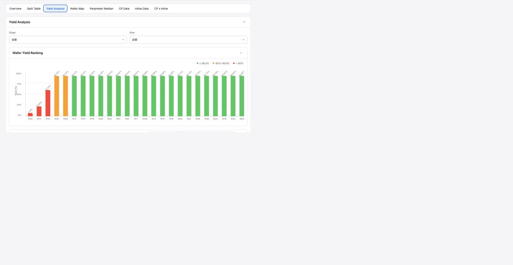

# Report Yield Analysis

## Intake

- Component name: Report Yield Analysis
- Sequence: 012
- Source page: `http://127.0.0.1:8888/DOE%20report.html`
- Parent prototype surface: `DOE Report`
- Source screenshot: `screenshot.png`
- Intake status: Raw prototype observation from user-directed browser review

## Screenshot



## User Notes

```text
除了左侧的侧边栏，重点是看右侧 各个 tabs 每个 tab 都是一个大业务组件，
然后 每个tab 里面 酌情分解。
```

This record treats the `Yield Analysis` tab as one large report business
component.

## Observed UI Region

The screenshot shows the `DOE Report` surface with the `Yield Analysis` tab
active.

Visible headings:

- `Yield Analysis`
- `Wafer Yield Ranking`
- `Yield Detail Analysis`

Visible controls:

- `Stage` selector, default `全部`
- `Step` selector, default `全部`
- Detail mode controls including `Wafer x CP Matrix`, `Loss Yield`, and
  `Condition Yield Comparison`

Visible chart themes:

- Wafer yield ranking bar chart.
- Yield threshold legend: `>= 99.5%`, `90%-99.5%`, `< 90%`.
- Wafer labels such as `W03`, `W12`, `W10`, `W25`.
- Yield values ranging from very low values to high 99% values.

## Candidate Domain Boundary

Candidate responsibilities:

- Present report-level wafer yield ranking for an experiment.
- Filter yield analysis by stage and step.
- Visualize yield threshold severity across wafers.
- Provide detail-analysis mode selection for matrix, loss yield, and condition
  comparison views.
- Expose selected wafer or selected mode changes through local callbacks.

Out of scope during intake:

- No root-cause judgment for low yield.
- No recomputation of raw CP, fail, or die-level yield inside the component.
- No report data fetch.
- No ownership of report tab navigation.

## Candidate Decomposition

- Stage / step filter bar
- Wafer yield ranking chart
- Yield severity legend
- Yield detail mode selector
- Wafer selector / highlighted wafer model
- Detail analysis panel boundary

## Open Questions

- Are `Loss Yield` and `Condition Yield Comparison` part of this component's V1,
  or follow-up subcomponents?
- What is the exact threshold contract for yellow and red yield states?
- Should the chart sort by yield ascending, wafer order, or selected grouping?
- How should selected wafers coordinate with Wafer Map and CP Data report tabs?
