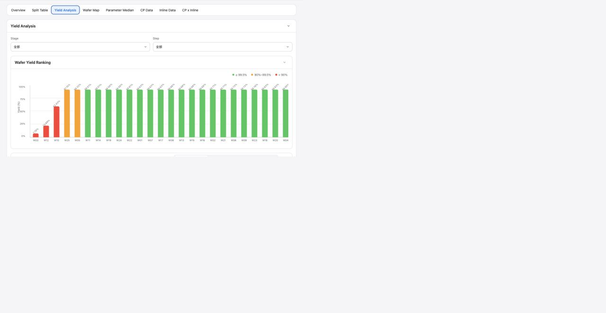

# Report Yield Analysis

## Intake

- Component name: Report Yield Analysis
- Sequence: 012
- Source page: `http://127.0.0.1:8888/DOE%20report.html`
- Parent prototype surface: `DOE Report`
- Source screenshot: `screenshot.png`
- Intake status: Raw prototype observation from user-directed browser review

## Screenshot



## User Notes

```text
除了左侧的侧边栏，重点是看右侧 各个 tabs 每个 tab 都是一个大业务组件，
然后 每个tab 里面 酌情分解。
```

This record treats the `Yield Analysis` tab as one large report business
component.

## Observed UI Region

The screenshot shows the `DOE Report` surface with the `Yield Analysis` tab
active.

Visible headings:

- `Yield Analysis`
- `Wafer Yield & CP Fail Analysis`
- `Yield Detail Analysis`

Visible controls:

- `Stage` selector, default `全部`
- `Step` selector, default `全部`
- Detail mode controls including `Wafer x CP Matrix`, `Loss Yield`, and
  `Condition Yield Comparison`

Visible chart themes:

- Wafer yield line chart on a shared 0–100% scale.
- CP Fail stacked bars limited by the configured fail threshold.
- Condition, Wafer ID, and grouped Step labels on the x axis.

## Candidate Domain Boundary

Candidate responsibilities:

- Present report-level wafer yield and CP fail comparison for an experiment.
- Filter yield analysis by stage and step.
- Visualize source-provided Yield and CP Fail percentages across wafers.
- Provide detail-analysis mode selection for matrix, loss yield, and condition
  comparison views.
- Expose selected wafer or selected mode changes through local callbacks.

Out of scope during intake:

- No root-cause judgment for low yield.
- No recomputation of raw CP, fail, or die-level yield inside the component.
- No report data fetch.
- No ownership of report tab navigation.

## Candidate Decomposition

- Stage / step filter bar
- Wafer yield and CP fail combination chart
- Yield and visible CP fail legend
- Yield detail mode selector
- Wafer selector / highlighted wafer model
- Detail analysis panel boundary

## Open Questions

- Are `Loss Yield` and `Condition Yield Comparison` part of this component's V1,
  or follow-up subcomponents?
- What is the upstream source of the configured CP Fail threshold?
- How should selected wafers coordinate with Wafer Map and CP Data report tabs?

## Post-intake Implementation Notes

- `Loss Yield` and `Condition Yield Comparison` are included in
  `ReportYieldAnalysis` V1 as tabbed detail tables.
- The chart preserves injected wafer order and shares a 0–100% vertical scale
  between Wafer Yield and CP Fail percentages.
- CP Fail segments are visible only when their supplied percentage is strictly
  greater than `failThresholdPercent`; the current scenario uses `2%`.
- The x axis shows Condition vertically, Wafer ID horizontally, and groups
  consecutive wafers under Step.
- Stage / Step filters are external business state for this component. The
  component receives filtered business data through schema-shaped input and
  only emits filter callback intents.
- Hover and keyboard focus disclose source-provided Yield and visible CP Fail
  evidence; the chart does not calculate source business facts.
- The 2026-09-22 annotation review removed the previous Wafer Yield Ranking
  chart and relocated `Wafer Yield & CP Fail Analysis` from Split Table into
  this component.
