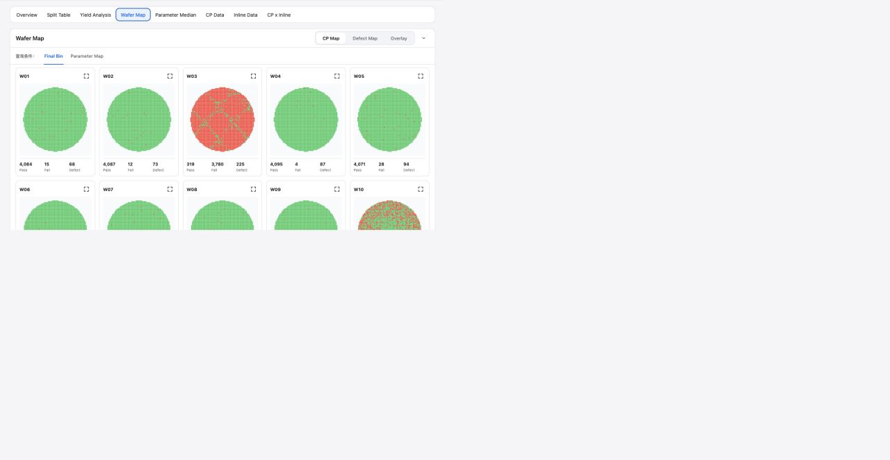

# Report Wafer Map

## Intake

- Component name: Report Wafer Map
- Sequence: 013
- Source page: `http://127.0.0.1:8888/DOE%20report.html`
- Parent prototype surface: `DOE Report`
- Source screenshot: `screenshot.png`
- Intake status: Raw prototype observation from user-directed browser review

## Screenshot



## User Notes

```text
除了左侧的侧边栏，重点是看右侧 各个 tabs 每个 tab 都是一个大业务组件，
然后 每个tab 里面 酌情分解。
```

This record treats the `Wafer Map` tab inside `DOE Report` as one large report
business component.

Important implementation constraint:

```text
Report Wafer Map must reuse the existing shared WaferMap component.
Do not rebuild wafer die geometry, canvas rendering, or map drawing logic here.
```

## Observed UI Region

The screenshot shows the `DOE Report` surface with the `Wafer Map` tab active.

Visible heading:

- `Wafer Map`

Visible controls:

- Map mode buttons: `CP Map`, `Defect Map`, `Overlay`
- Layer controls: `Final Bin`, `Parameter Map`
- Query condition label: `查询条件：`

Visible content:

- Multiple wafer cards such as `W01`, `W02`, `W03`.
- Circular wafer visualizations with die-level color patterns.
- Per-wafer metrics such as `Pass`, `Fail`, and `Defect`.
- Card-level expand or inspect affordances.

## Candidate Domain Boundary

Candidate responsibilities:

- Present a report-level grid of wafer maps for a DOE report.
- Compose the shared `WaferMap` component for wafer visualization.
- Switch between CP map, defect map, and overlay report modes.
- Switch report layer views such as final bin and parameter map.
- Display wafer-level pass, fail, and defect counts alongside each map.
- Expose wafer selection, expand, and mode-change intents through local
  callbacks.

Out of scope during intake:

- No new wafer geometry renderer.
- No duplicated canvas map drawing logic.
- No separate die-coordinate layout engine.
- No mutation of die, bin, defect, or parameter data.
- No backend fetch or data normalization.
- No assumption that report map modes are fully equivalent to the standalone
  Wafer component V1.

## Candidate Decomposition

- Report wafer map toolbar
- Map mode segmented control
- Layer switch
- Wafer card grid
- Wafer map card
- Shared `WaferMap` adapter / data mapping boundary
- Wafer metric footer
- Wafer expand / inspect action

## Open Questions

- What adapter data is needed to pass report wafer data into the shared
  `WaferMap` component?
- Which map modes and layers are required for V1?
- How are `Pass`, `Fail`, and `Defect` counts computed and passed in?
- What interaction is expected when a wafer card is expanded?
- Should selected parameters come from this tab, Parameter Median, or CP Data?
