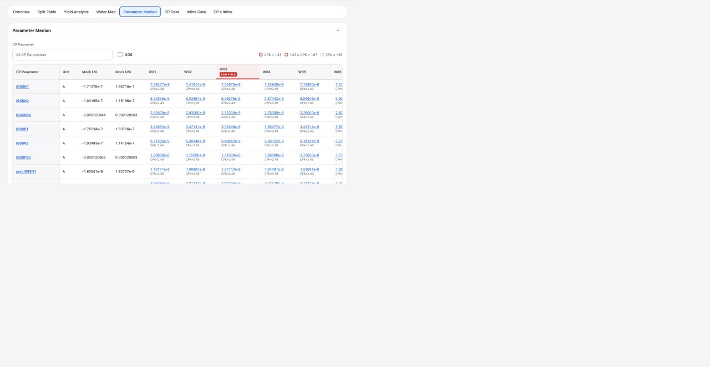

# Report Parameter Median

## Intake

- Component name: Report Parameter Median
- Sequence: 014
- Source page: `http://127.0.0.1:8888/DOE%20report.html`
- Parent prototype surface: `DOE Report`
- Source screenshot: `screenshot.png`
- Intake status: Raw prototype observation from user-directed browser review

## Screenshot



## User Notes

```text
除了左侧的侧边栏，重点是看右侧 各个 tabs 每个 tab 都是一个大业务组件，
然后 每个tab 里面 酌情分解。
```

This record treats the `Parameter Median` tab as one large report business
component.

## Observed UI Region

The screenshot shows the `DOE Report` surface with the `Parameter Median` tab
active.

Visible heading:

- `Parameter Median`

Visible controls and legend:

- `CP Parameter` selector.
- `OOS` filter.
- CPK legend: `CPK < 1.33`, `1.33 <= CPK < 1.67`, `CPK >= 1.67`.

Visible matrix columns:

- `CP Parameter`
- `Unit`
- `Mock LSL`
- `Mock USL`
- Wafer columns such as `W01`, `W02`, `W03`, through `W25`.

Visible cell themes:

- Parameter rows such as `IGSSN1`.
- Scientific notation median values.
- Per-cell `CPK=...` values.
- Low-yield wafer markers.

## Candidate Domain Boundary

Candidate responsibilities:

- Present a report matrix of CP parameter medians by wafer.
- Display parameter unit, lower spec, upper spec, wafer median, and CPK values.
- Filter by CP parameter and OOS state.
- Highlight CPK threshold severity and low-yield wafer context.
- Preserve horizontal matrix inspection ergonomics for many wafers.

Out of scope during intake:

- No calculation of median or CPK inside the visual component unless explicitly
  required by implementation input.
- No claim that `Mock LSL` and `Mock USL` are production specifications.
- No backend data fetch or parameter source resolution.
- No final OOS engineering judgment beyond supplied data state.

## Candidate Decomposition

- CP parameter filter bar
- OOS toggle / filter
- CPK severity legend
- Parameter-by-wafer matrix
- Sticky parameter metadata columns
- Wafer header with low-yield annotation
- Median value and CPK cell

## Open Questions

- Are `Mock LSL` and `Mock USL` temporary prototype labels or final report
  fields?
- Should OOS filtering include only spec violations, CPK thresholds, or both?
- What is the expected behavior for hundreds of parameters or wafers?
- Should low-yield wafer context be supplied from Yield Analysis or duplicated
  in this component's data?

## Post-intake Implementation Notes

- Current implementation keeps `Mock LSL` and `Mock USL` as prototype-backed
  report fields and does not treat them as production specifications.
- `CP Parameter` is implemented as a shadcn/base Input form control, not a
  combobox. Its value is emitted as callback intent for the business layer.
- `仅显示 OOS` is implemented as a checkbox callback intent. The component does
  not filter rows internally; filtered data is expected to be injected back into
  the component.
- The matrix supports sticky header and sticky first column for wide report
  inspection.
- OOS flags, CPK values, and median values are supplied by schema-shaped data;
  the component does not recompute median, CPK, or final engineering judgment.
