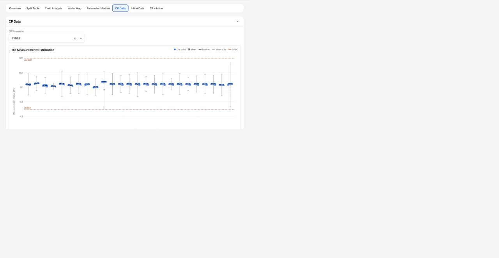

# Report CP Data

## Intake

- Component name: Report CP Data
- Sequence: 015
- Source page: `http://127.0.0.1:8888/DOE%20report.html`
- Parent prototype surface: `DOE Report`
- Source screenshot: `screenshot.png`
- Intake status: Raw prototype observation from user-directed browser review

## Screenshot



## User Notes

```text
除了左侧的侧边栏，重点是看右侧 各个 tabs 每个 tab 都是一个大业务组件，
然后 每个tab 里面 酌情分解。
```

This record treats the `CP Data` tab as one large report business component.

Important implementation constraint:

```text
Report CP Data must reuse the shared Measurement component for the distribution chart.
Do not build a CP-only measurement chart inside this tab component.
```

## Observed UI Region

The screenshot shows the `DOE Report` surface with the `CP Data` tab active.

Visible heading:

- `CP Data`

Visible controls:

- `CP Parameter` selector, showing a selected parameter such as `BVDSS`.

Visible chart:

- `Die Measurement Distribution`
- Legend entries: `Die point`, `Mean`, `Median`, `Mean +/-3σ`, `SPEC`
- Y-axis parameter value scale.
- Wafer-by-wafer grouped distribution points and reference lines.
- Spec boundary labels such as LSL and USL.

## Candidate Domain Boundary

Candidate responsibilities:

- Present die-level CP measurement distribution for a selected CP parameter.
- Compose `Measurement` for the die measurement distribution chart.
- Compare wafer-level die points with mean, median, sigma band, and spec lines.
- Allow the selected CP parameter to change through a controlled input.
- Expose chart point, wafer, or parameter selection intents if needed by the
  report shell.

Out of scope during intake:

- No duplicated measurement distribution chart implementation.
- No raw CP data fetch.
- No statistical recomputation unless required by the implementation input
  contract.
- No CP-to-inline fitting logic.
- No mutation of CP test records or spec limits.

Code-observed interaction evidence:

- CP parameter input opens a searchable menu on focus, click, input, and
  ArrowDown.
- Escape closes the parameter menu.
- Clear button empties the selected parameter and reopens the menu.
- Non-`BVDSS` parameters show an empty state in the prototype because source die
  measurement data is not embedded for those parameters.
- Hover on the chart highlights the related baseline/split group and shows the
  nearest die measurement tooltip.
- Click on the chart opens a wafer group detail distribution modal.
- Detail modal supports close, Escape, zoom in, zoom out, reset, and wheel zoom.

## Candidate Decomposition

- CP parameter selector
- `Measurement` adapter / data mapping boundary
- Spec and statistic legend
- Wafer grouping axis
- Measurement point layer
- Mean / median / sigma reference layers
- Optional point or wafer detail interaction

## Open Questions

- Are mean, median, and sigma values precomputed or component-derived from
  supplied die points?
- How many wafers and die points must render smoothly in the expected report?
- Should this component share parameter selection state with Parameter Median
  and CP x Inline?
- What tooltip or drilldown is expected for individual die measurement points?
