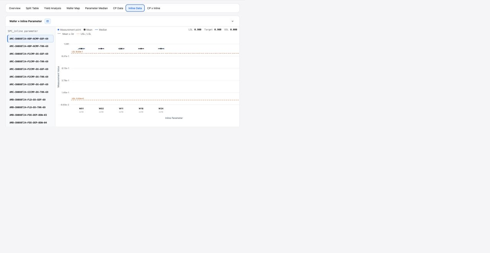

# Report Inline Data

## Intake

- Component name: Report Inline Data
- Sequence: 016
- Source page: `http://127.0.0.1:8888/DOE%20report.html`
- Parent prototype surface: `DOE Report`
- Source screenshot: `screenshot.png`
- Intake status: Raw prototype observation from user-directed browser review

## Screenshot



## User Notes

```text
除了左侧的侧边栏，重点是看右侧 各个 tabs 每个 tab 都是一个大业务组件，
然后 每个tab 里面 酌情分解。
```

This record treats the `Inline Data` tab as one large report business component.

Important implementation constraint:

```text
Report Inline Data must reuse the shared Measurement component for the distribution chart.
Do not build an Inline-only measurement chart inside this tab component.
```

## Observed UI Region

The screenshot shows the `DOE Report` surface with the `Inline Data` tab active.

Visible title area:

- `Wafer x Inline Parameter`

Visible controls and content:

- Left-side inline parameter list.
- Selected inline parameter row.
- Main chart area comparing wafers.
- Legend entries such as `Measurement point`, `Mean`, `Median`, `Mean +/-3σ`,
  `LSL / USL`.
- Reference summary values such as `LSL`, `Target`, and `USL`.
- Wafer labels such as `W01`, `W02`, `W11`, `W18`, and `W24`.

## Candidate Domain Boundary

Candidate responsibilities:

- Present wafer-by-inline-parameter report data for one selected inline
  parameter.
- Compose `Measurement` for the wafer x inline parameter measurement chart.
- Let users choose an inline parameter from the available report parameter list.
- Visualize wafer-level inline measurements against LSL, target, and USL.
- Expose selected inline parameter or wafer intents through local callbacks.

Out of scope during intake:

- No duplicated measurement distribution chart implementation.
- No inline data fetch or metrology source integration.
- No confirmed mapping from inline stage to DOE step unless provided by upstream
  data.
- No CP correlation or fitting behavior.
- No mutation of inline measurement records or limits.

Code-observed interaction evidence:

- Inline Data is iframe-hosted in the prototype and sources behavior from the
  embedded `stage dashboard.html?embed=inline` page.
- It renders accepted inline/SPC data by selected parameter and wafer.
- Filters include selected parameter, detail wafer, current median status,
  parameter search, type, and matrix status.
- Parameter row click changes the selected parameter.
- Matrix cell click changes both selected parameter and wafer.
- Wafer coverage click toggles wafer focus.
- Measurement point inspection supports hover, click lock, keyboard left/right
  browsing, and Escape unlock.

## Candidate Decomposition

- Inline parameter list
- Selected parameter state
- `Measurement` adapter / data mapping boundary
- Spec / target summary
- Measurement point layer
- Mean / median / sigma reference layers
- Optional wafer detail interaction

## Open Questions

- What is the canonical inline parameter identity format?
- Are LSL, target, and USL required for every inline parameter?
- Should the parameter list support search, grouping, or virtualization?
- How should this component coordinate selected parameters with CP x Inline?
