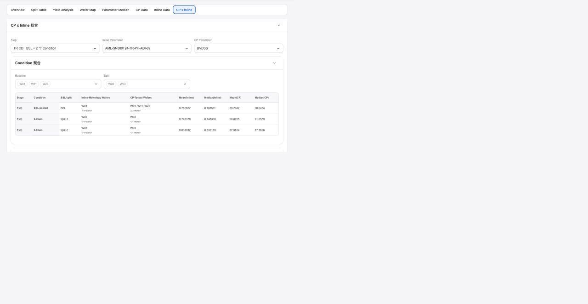

# Report CP x Inline

## Intake

- Component name: Report CP x Inline
- Sequence: 017
- Source page: `http://127.0.0.1:8888/DOE%20report.html`
- Parent prototype surface: `DOE Report`
- Source screenshot: `screenshot.png`
- Intake status: Raw prototype observation from user-directed browser review

## Screenshot



## User Notes

```text
除了左侧的侧边栏，重点是看右侧 各个 tabs 每个 tab 都是一个大业务组件，
然后 每个tab 里面 酌情分解。
```

This record treats the `CP x Inline` tab as one large report business component.

## Observed UI Region

The screenshot shows the `DOE Report` surface with the `CP x Inline` tab active.

Visible title area:

- `CP x Inline 拟合`

Visible selectors:

- `Step`
- `Inline Parameter`
- `CP Parameter`

Visible aggregation section:

- `Condition 聚合`
- Baseline wafer selection.
- Split wafer selection.
- Aggregation table.

Visible table columns:

- `Stage`
- `Condition`
- `BSL/Split`
- `Inline-Metrology Wafers`
- `CP-Tested Wafers`
- `Mean(Inline)`
- `Median(Inline)`
- `Mean(CP)`
- `Median(CP)`

## Candidate Domain Boundary

Candidate responsibilities:

- Present report-level CP-to-inline relationship evidence for selected step,
  inline parameter, and CP parameter.
- Compare baseline and split wafer groups.
- Display condition-level aggregation for inline and CP tested wafer sets.
- Surface mean and median values for both inline and CP data.
- Expose parameter, step, baseline wafer, and split wafer changes through local
  callbacks.

Out of scope during intake:

- No final causal conclusion from CP x Inline data.
- No hidden statistical model fitting or confidence calculation unless the
  upstream contract provides it.
- No data fetch or cross-source joining inside the component.
- No assumption that inline-to-CP stage mapping is valid without source evidence.

## Candidate Decomposition

- Step / parameter selector bar
- Condition aggregation panel
- Baseline wafer selector
- Split wafer selector
- Inline wafer evidence cell
- CP wafer evidence cell
- Aggregation metric table
- Optional fit chart or fit-summary panel

## Open Questions

- Does `拟合` require an actual regression or only grouped comparison in V1?
- Which source owns the mapping between inline parameter, CP parameter, and DOE
  step?
- Should baseline and split wafer selection be interactive report filters or
  read-only evidence chips?
- What statistical outputs, if any, should be displayed beyond mean and median?
