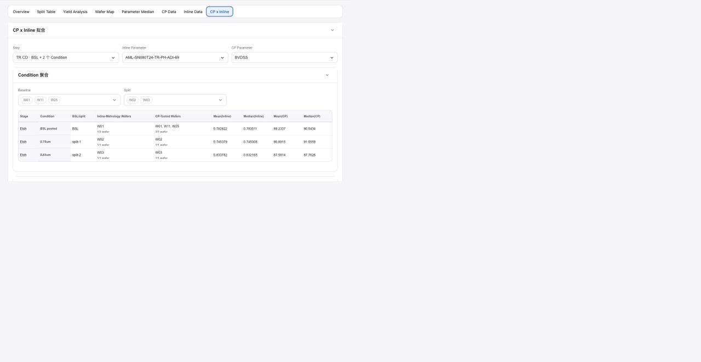

# Report CP x Inline

## Intake

- Component name: Report CP x Inline
- Sequence: 017
- Source page: `http://127.0.0.1:8888/DOE%20report.html`
- Parent prototype surface: `DOE Report`
- Source screenshot: `screenshot.png`
- Intake status: Raw prototype observation from user-directed browser review

## Screenshot



## 2026-09-23 Alignment Decision

- Current alignment baseline: `http://localhost:8888/DOE%20Workbench%20%E5%8D%95%E6%96%87%E4%BB%B6%E7%89%88.html`, `DOE Report` → `CP x Inline`.
- Alignment scope: reproduce the complete user-visible capability and business semantics of the current prototype tab, including selectors, condition aggregation, fit configuration, fit evidence, unavailable states, collapsible sections, responsive stacking, and local overflow behavior.
- Repository boundary: align the Domain UI contract and presentation rather than copying the prototype implementation. Regression, quadratic fitting, root solving, and control-window derivation enter the component as source-provided evidence; the component renders them and emits selection intent.
- Excluded application chrome: Workbench sidebar, top navigation, Report tab routing, data loading, and cross-tab workflow remain consumer responsibilities.
- Inspected prototype sources include `round-report/js/renderers/inline-fit-selection.js`, `round-report/js/renderers/parameters-inline.js`, `round-report/js/review-notes.js`, and `round-report/styles/report.css` from the packed Workbench file.

This decision supersedes the earlier placeholder scope that stopped at condition aggregation and fit-readiness.

## User Notes

```text
除了左侧的侧边栏，重点是看右侧 各个 tabs 每个 tab 都是一个大业务组件，
然后 每个tab 里面 酌情分解。
```

This record treats the `CP x Inline` tab as one large report business component.

## Observed UI Region

The screenshot shows the `DOE Report` surface with the `CP x Inline` tab active.

Visible title area:

- `CP x Inline 拟合`

Visible selectors:

- `Step`
- `Inline Parameter`
- `CP Parameter`

Visible aggregation section:

- `Condition 聚合`
- Baseline wafer selection.
- Split wafer selection.
- Aggregation table.

Visible table columns:

- `Stage`
- `Condition`
- `BSL/Split`
- `Inline-Metrology Wafers`
- `CP-Tested Wafers`
- `Mean(Inline)`
- `Median(Inline)`
- `Mean(CP)`
- `Median(CP)`

## Approved Domain Boundary

Responsibilities:

- Present report-level CP-to-inline relationship evidence for selected step,
  inline parameter, and CP parameter.
- Compare baseline and split wafer groups.
- Display condition-level aggregation for inline and CP tested wafer sets.
- Surface mean and median values for both Inline and CP data.
- Present source-provided linear and quadratic fit candidates, model evidence,
  roots, thresholds, and an optional Inline Control Window.
- Preserve coverage differences between the Condition aggregation and
  same-wafer paired fit populations.
- Expose parameter, step, baseline wafer, and split wafer changes through local
  callbacks.

Out of scope:

- No final causal conclusion from CP x Inline data.
- No regression, quadratic fitting, root solving, confidence calculation, or
  control-window derivation inside the component.
- No data fetch or cross-source joining inside the component.
- No assumption that inline-to-CP stage mapping is valid without source evidence.
- No recommendation, Recipe setpoint, production instruction, or release verdict.

## Approved Component Anatomy

- `CP x Inline 拟合`: collapsible selector section for Step, Inline Parameter,
  and CP Parameter.
- `Condition 聚合`: collapsible section with Baseline and Split wafer
  multi-selection, coverage counts, and the nine-column aggregation table.
- `拟合与定位`: Fit Grain, Inline metric, CP aggregation, extreme policy, and
  Quadratic controls followed by Median, Min, and Max result panels.
- Each result panel keeps its chart visible, exposes local evidence details on
  demand, and explains unavailable states in place.
- On narrow viewports the sections and panels stack; wide tables and charts
  keep local overflow instead of widening the page.

## Visual Authority

The Workbench prototype determines this component's information architecture,
visible capability, interaction structure, and state coverage. `DESIGN.md` and
the design-system documents it routes to determine typography, density, colour,
spacing, radius, and component styling. Workbench application chrome is not
part of this component.

## Interaction Ownership

- Step, Inline Parameter, CP Parameter, Baseline wafers, Split wafers, Fit
  Grain, Inline metric, CP aggregation, extreme policy, and Quadratic enabled
  state are controlled values with callbacks.
- The same Baseline and Split wafer selection drives both Condition
  aggregation and paired-Wafer evidence; the component must not maintain a
  second hidden wafer selection.
- Collapse state, chart hover, tooltips, and per-panel evidence-detail
  disclosure are local presentation state.
- The consumer owns data loading, option availability, cross-tab workflow, and
  recomputing the evidence payload after a selection changes.

## Evidence Contract

- Condition aggregation retains separate valid Inline and CP wafer populations.
  Missing observations are not imputed and do not silently remove the other
  source's valid evidence.
- Paired-Wafer fitting uses only the same-wafer intersection.
- Coverage evidence preserves `PAIRED`, `INLINE_ONLY`, `CP_ONLY`, and `NO_DATA`
  status rather than reducing coverage to a count or boolean.
- Fit candidates arrive as typed source evidence. Linear fitting requires at
  least two usable Condition levels; quadratic fitting requires at least three.
  Gate results and unavailable reasons are explicit input, not inferred from
  rendered point count.
- Linear and quadratic candidates remain peer evidence. The component does not
  automatically label either one as the primary or best model.
- Median, Min, and Max result panels receive their own points, candidate models,
  equations, fit metrics, thresholds, roots, domain, coverage, and provenance.
- The Inline Control Window is permitted as read-only `Source Provisional`
  evidence. It must retain its constraint basis and observation domain and must
  not acquire recommendation or Recipe semantics.

## Scenario Matrix

The component package must keep these executable scenarios:

1. Normal prototype-backed BVDSS evidence with no configured CP specification.
2. Configured CP Target / LSL / USL with roots and an Inline Control Window.
3. Coverage mismatch containing paired, Inline-only, CP-only, and no-data
   evidence.
4. Insufficient Condition levels for one or more fit candidates.
5. Partial upstream evidence where some result panels remain available.
6. Empty state with no fit evidence.
7. Dense data when needed to verify local table/chart overflow and responsive
   stacking.

Scenario data belongs in fixtures and scenarios. It must not be embedded in
the component rendering logic.

## Implementation Package

The aligned implementation is expected to update the report orchestrator,
UI-facing schema, fixtures, scenarios, MDX preview, focused tests, and a
CP-inline-specific fit chart or evidence-panel helper where decomposition keeps
the main component readable. It should add the local shadcn `Switch` primitive,
reuse the repository's existing `Combobox`, `Select`, `Collapsible`, `Checkbox`,
`Card`, `Table`, `Field`, and `Tooltip` primitives, and use the already-installed
Recharts and Zod dependencies. No new runtime package is required.

## Data Fidelity

- Prototype-backed fixture values must be transcribed exactly, including source
  identifiers and coverage membership.
- Inline display precision is six decimal places and CP display precision is
  four decimal places unless the evidence payload supplies a more explicit
  display contract.
- Missing values remain missing; unavailable and insufficient evidence retain
  distinct reasons.
- Each result panel keeps source/provenance context visible or locally
  discoverable. Provisional evidence is labelled rather than promoted to fact.

## Acceptance Criteria

- All three approved sections and all Median, Min, and Max result panels are
  represented in the component and documentation preview.
- Every business selection is controlled and emits a callback; changing the
  shared wafer selection affects both evidence grains through one contract.
- Condition and paired-Wafer population rules, coverage statuses, fit gates,
  candidate models, thresholds, roots, and provisional windows render without
  hidden calculation.
- Normal, configured-spec, coverage-mismatch, insufficient-levels, partial,
  empty, and applicable dense scenarios are independently reviewable.
- The visual hierarchy follows the Workbench structure while styling follows
  the DOE design system, including responsive stacking and local overflow.
- Targeted typecheck, targeted lint, focused tests, changed-interaction browser
  verification, and one final full build pass.

## Resolved Decisions

- `拟合` includes complete fit evidence rather than grouped comparison alone.
- The upstream/consumer contract owns Step and parameter mapping.
- Baseline and Split wafers are interactive controlled report filters.
- Mean and median aggregation, linear and quadratic fit candidates, fit
  metrics, roots, thresholds, coverage, provenance, and optional provisional
  control-window evidence are in scope.
- The approved target is the current Workbench tab, not the earlier screenshot
  placeholder.

## Implementation Status

The target contract is approved. This record does not claim that the current
component, schema, fixtures, scenarios, or preview already satisfy it; those
changes belong to the next implementation step.

## 2026-09-27 Candidate Ranking Addendum

- New evidence: the real `RND_AF01112_CP_DEMO` 5173 surface and the reviewed
  CP × Inline data map establish a generation-fixed Candidate Ranking before
  the selected-pair analysis.
- The ranking is a separate Domain UI asset because its filters, pagination,
  Backend order, and loading lifecycle are independent from the selected fit.
- `ReportCpInlineCandidates` renders Backend-supplied rows without recomputing
  score or order. Filter, page, and `View fit` actions are callback intents.
- The consumer composes the ranking above `ReportCpInline` and owns the handoff
  from a candidate key to the selected analysis plus any scroll behavior.

## 2026-10-09 Candidates / Fit Revision (Supersedes Previous Anatomy)

- User-approved evidence: `DOE Workbench 单文件版(1).html` on localhost:8888,
  packed `cp-inline-candidate-prototype/index.html` and `real-data.js`, and two annotated screenshots.
- Two independently consumable components are named Candidates and Fit; the MDX has their two standalone previews plus a combined preview.
- Candidates preserves existing generation-fixed score/classification, with Recommended / Filtered / Insufficient Sample views, Step/CP/Inline filters, exact paired-N and primary reason column filters, and pagination.
- The new prototype's score formula is not adopted. Old INLINE_CONSTANT/CP_CONSTANT and unfiltered LOW semantics remain honest. Keep experiment-group identity even though the new prototype has only one row per parameter pair.
- Fit contains only Wafer Pair detail plus three Wafer Scatter & Fits (CP Median/Min/Max). It displays supplied regression/correlation/spec/root evidence and does not decide availability from N. Local collapses and per-chart model visibility are presentation only.
- Removed from this revision: Condition aggregation, business fit-config selectors, Control Window and Leave-One-Out Stability. This supersedes the prior three-section anatomy and Condition gate contract for this tab.
- Combined preview uses the exact local shadcn Base Drawer non-modal pattern from `ui/apps/v4/examples/base/drawer-non-modal.tsx`: modal=false, disablePointerDismissal, swipeDirection=right. Product content replaces the demonstration placeholder; existing local Drawer is reused without a competing primitive.
- Only the selected group's matching evidence is shown. Candidate/detail requests remain consumer-owned; mismatched identity remains waiting rather than revealing stale detail.
- Existing data evidence: reviewed `db-probe/notebooks/tabs/computed fileds/inline-condition-vs-cp/cp_x_inline.ipynb`, Generation 13. Three persisted ranking rows are retained; kelvinS wafer summaries are transcribed exactly. Fit curves/metrics/roots are derived offline for fixtures, never at runtime. QG_QgTOT2 remains a separate prototype-backed Fit scenario.
- Correct the prototype scientific-formatting error (e-10 became e-1) and avoid fixed-decimal tiny CP values rendering as zero. Prototype meta counts are not copied; counts come from the rendered dataset.
- Visual revision: bounded responsive chart within its evidence column, existing DOE table local overflow and a named Fit Drawer inspection-width token. Positive/negative Spearman use existing chart-2/chart-5 with a signed numeric value, without indicating causal/pass judgment.
