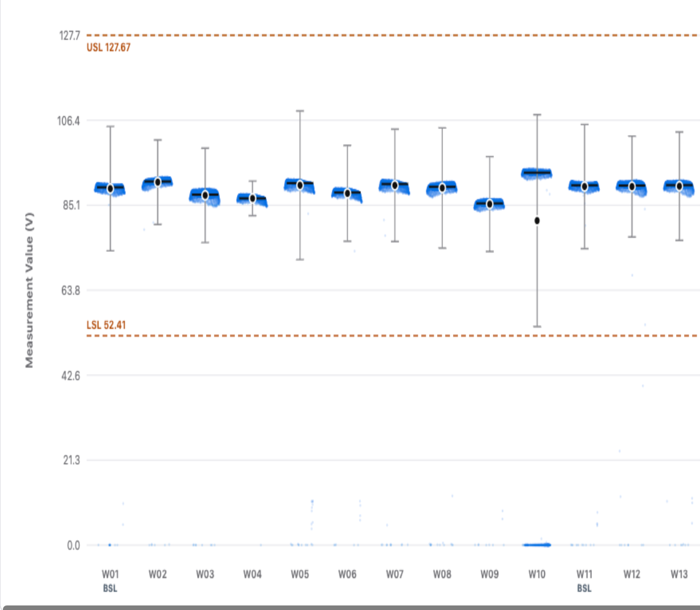

# Measurement

## Intake

- Component name: Measurement
- Sequence: 018
- Source screenshot: `screenshot.png`
- Original screenshot filename: `codex-clipboard-29ccf97e-a3ba-4df6-b550-bf1f023c92b3.png`
- Original screenshot size: 1230 x 1072
- Intake status: Raw user input

## Screenshot



## User Notes

```text
cpdata 和 inline data 这两个 tab 里面 也用到同一个组件
但是这个组件没创建 命名就叫 Measurement
参考 wafer map 在 upstream 文件夹里 有对应的 009-wafer 也要创建一个 上游 组件
```

## Observed UI Region

The screenshot shows a reusable measurement distribution chart.

Visible chart elements:

- Y-axis label: `Measurement Value (V)`
- Wafer / condition x-axis labels such as `W01`, `W02`, `W03`, and `W11 BSL`.
- Blue measurement point clusters per wafer.
- Black center markers.
- Gray vertical range / variation markers.
- Orange dashed specification lines.
- Inline spec labels such as `USL 127.67` and `LSL 52.41`.
- Light horizontal grid lines.

## Candidate Domain Boundary

This upstream input suggests a shared domain visualization component used by
both report CP data and report inline data.

Candidate responsibilities:

- Render grouped measurement distributions by wafer, condition, or another
  report-provided group key.
- Display raw measurement points.
- Display central tendency markers such as mean and/or median.
- Display variation or spread markers such as sigma range.
- Display specification or target reference lines such as LSL, USL, and target.
- Support both CP measurement data and inline/metrology measurement data through
  a shared visual model.
- Expose local interaction callbacks for group, point, or reference-line
  inspection when needed by parent report tabs.

Out of scope during intake:

- No report tab layout ownership.
- No CP-specific or inline-specific business branching inside the core chart.
- No backend fetch, cross-source joining, or data normalization.
- No hidden statistical calculation unless explicitly required by the component
  contract.
- No wafer map, die geometry, or spatial rendering behavior.

## Shared Usage Constraint

```text
Report CP Data and Report Inline Data must compose Measurement for this chart.
Do not build separate CP-only or Inline-only measurement distribution charts.
```

Expected parent usage:

- `015-report-cp-data/` uses `Measurement` for die measurement distribution.
- `016-report-inline-data/` uses `Measurement` for wafer x inline parameter
  measurement distribution.

## Code Evidence First Pass

Evidence from the local prototype source supports this shared boundary:

- `CP Data` renders the distribution with `canvas#boxCpkCanvas`.
- `Inline Data` renders grouped inline measurement distributions from accepted
  SPC records in an embedded page.
- Both flows use the same visual grammar: grouped wafers, measurement points,
  mean, median, mean +/- 3 sigma, and LSL / USL style reference lines.
- CP Data has hover tooltip, click-to-detail modal, Escape close, zoom controls,
  reset, and wheel zoom behavior.
- Inline Data has parameter, wafer, status, type, matrix status, and search
  filtering, plus hover / click / keyboard point inspection.

See `../report-code-first-pass.md` for the full code-evidence summary.

## Candidate Decomposition

- Measurement chart container
- Grouped x-axis model
- Numeric y-axis model
- Measurement point layer
- Mean / median marker layer
- Variation / sigma range layer
- Spec / target reference-line layer
- Legend model
- Tooltip / inspection callback boundary

## Open Questions

- Should `Measurement` calculate mean, median, and sigma from raw points, or
  receive all summary statistics precomputed?
- What is the canonical input schema for mixed CP and inline measurement data?
- Does V1 need horizontal scrolling, zooming, or brushing for many wafers?
- Are out-of-spec points visually encoded by this component or by parent data?
- Should LSL, USL, and target all be optional reference lines?
